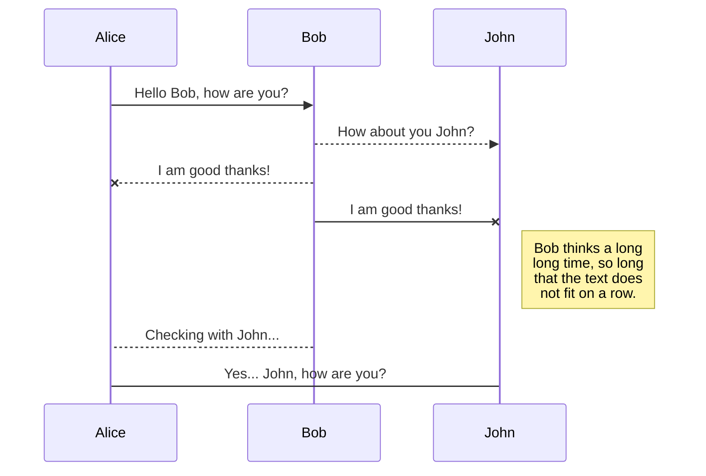
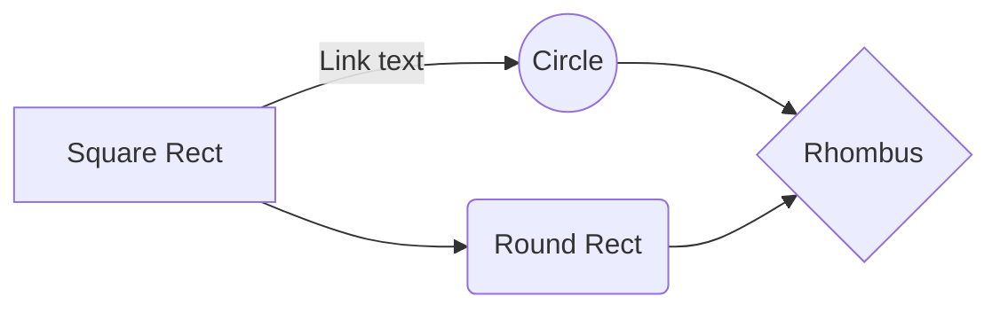

# Cuckoo Sandbox!
**Language:**  
[](test.com)[](test.com)

Cuckoo Sandbox açık kaynaklı Malware analiz sistemidir. Bunu yalıtılmış bir ortamda gerçekleştirir ve size geniş çaplı bir rapor sunar.
Cuckoo Sandbox'u kendi kişisel cihazınızda ya da sunucunuz da otomatik kurmak için gerekli adımları izlemeniz yeterli. 

Cuckoo Sandbox is an open source Malware analysis system. It does this in an isolated environment and gives you a comprehensive report.
Just follow the necessary steps to automatically install Cuckoo Sandbox on your own personal device or server.


# Başlangıç

Başlamadan önce anlık görüntü yedeği almayı unutmayın.
Don't forget to take a snapshot backup before you start.

```console
dogukankurnaz@ubuntu:~$ git clone https://github.com/dogukankurnaz/cuckoo.git
dogukankurnaz@ubuntu:~$ cd cuckoo
dogukankurnaz@ubuntu:~/Desktop/cuckoo$ ls
cuckoo_pre.sh  cuckoo_virtualmachine.sh  README.md  virtualenvwrapper.sh
dogukankurnaz@ubuntu:~/Desktop/cuckoo$ find -type f -name '*.sh' -exec chmod +x {} +
```


## ./cuckoo_pre.sh

```console
dogukankurnaz@ubuntu:~$ sudo ./cuckoo_pre.sh
```


## ./virtualenvwrapper.sh

```console
dogukankurnaz@ubuntu:~$ sudo ./virtualenvwrapper.sh
```


```console
dogukankurnaz@ubuntu:~$ source ~/.bashrc
dogukankurnaz@ubuntu:~$ mkvirtualenv -p python2.7 cuckoo-test
dogukankurnaz@ubuntu:~$ pip install -U pip setuptools
dogukankurnaz@ubuntu:~$ pip install -U cuckoo
```

## ./cuckoo_virtualmachine.sh

```console
dogukankurnaz@ubuntu:~$ sudo ./cuckoo_virtualmachine.sh
```


## Configuration

We learn the interface name with the ifconfig, command. My device's is enp0s3.


```console
dogukankurnaz@ubuntu:~$ ifconfig
enp0s3: flags=4163<UP,BROADCAST,RUNNING,MULTICAST>  mtu 1500
        inet 10.0.2.15  netmask 255.255.255.0  broadcast 10.0.2.255
        inet6 fe80::b36b:4516:9694:c5cb  prefixlen 64  scopeid 0x20<link>
        ether 08:00:27:78:dd:64  txqueuelen 1000  (Ethernet)
        RX packets 3433080  bytes 5161919233 (5.1 GB)
        RX errors 0  dropped 0  overruns 0  frame 0
        TX packets 861572  bytes 52237366 (52.2 MB)
        TX errors 0  dropped 0 overruns 0  carrier 0  collisions 0

lo: flags=73<UP,LOOPBACK,RUNNING>  mtu 65536
        inet 127.0.0.1  netmask 255.0.0.0
        inet6 ::1  prefixlen 128  scopeid 0x10<host>
        loop  txqueuelen 1000  (Local Loopback)
        RX packets 4185  bytes 1123311 (1.1 MB)
        RX errors 0  dropped 0  overruns 0  frame 0
        TX packets 4185  bytes 1123311 (1.1 MB)
        TX errors 0  dropped 0 overruns 0  carrier 0  collisions 0

vboxnet0: flags=4099<UP,BROADCAST,MULTICAST>  mtu 1500
        inet 192.168.56.1  netmask 255.255.255.0  broadcast 192.168.56.255
        inet6 fe80::800:27ff:fe00:0  prefixlen 64  scopeid 0x20<link>
        ether 0a:00:27:00:00:00  txqueuelen 1000  (Ethernet)
        RX packets 0  bytes 0 (0.0 B)
        RX errors 0  dropped 0  overruns 0  frame 0
        TX packets 1171  bytes 119400 (119.4 KB)
        TX errors 0  dropped 0 overruns 0  carrier 0  collisions 0

```

your interface name=**enp0s3** (My Device)
We replace the part that says with the interface name of our own device.
```console
dogukankurnaz@ubuntu:~$ vmcloak list vms
dogukankurnaz@ubuntu:~$ sudo sysctl -w net.ipv4.conf.vboxnet0.forwarding=1
(if your network interface is different change me!)
dogukankurnaz@ubuntu:~$ sudo sysctl -w net.ipv4.conf.enp0s3.forwarding=1 
```


```console
dogukankurnaz@ubuntu:~$ sudo nano /etc/sysctl.conf
```


```console
dogukankurnaz@ubuntu:~$ sudo iptables -t nat -A POSTROUTING -o enp0s3 -s 192.168.56.0/24 -j MASQUERADE
dogukankurnaz@ubuntu:~$ sudo iptables -P FORWARD DROP
dogukankurnaz@ubuntu:~$ sudo iptables -A FORWARD -m state --state RELATED,ESTABLISHED -j ACCEPT
dogukankurnaz@ubuntu:~$ sudo iptables -A FORWARD -s 192.168.56.0/24 -j ACCEPT
```


```console
dogukankurnaz@ubuntu:~$ cuckoo init
```


```console
(cuckoo-test) cuckoo@cuckoo-VirtualBox:/$ cd /home/cuckoo/
(cuckoo-test) cuckoo@cuckoo-VirtualBox:~$ ls -la
total 120
drwxr-xr-x 18 cuckoo cuckoo 4096 Oca 18 20:25 .
drwxr-xr-x  3 root   root   4096 Kas 30 22:50 ..
-rw-r--r--  1 cuckoo cuckoo  220 Kas 30 22:50 .bash_logout
-rw-r--r--  1 cuckoo cuckoo 4256 Oca 18 00:17 .bashrc
drwx------ 15 cuckoo cuckoo 4096 Oca 18 00:17 .cache
drwx------ 12 cuckoo cuckoo 4096 Oca 18 00:05 .config
drwxrwxr-x 17 cuckoo cuckoo 4096 Oca 18 20:25 .cuckoo
drwxr-xr-x  4 cuckoo cuckoo 4096 Oca 18 01:02 Desktop
drwxr-xr-x  2 cuckoo cuckoo 4096 Kas 30 22:58 Documents
drwxr-xr-x  2 cuckoo cuckoo 4096 Kas 30 22:58 Downloads
-rw-r--r--  1 cuckoo cuckoo 8980 Kas 30 22:50 examples.desktop
drwx------  3 cuckoo cuckoo 4096 Kas 30 22:57 .gnupg
-rw-------  1 cuckoo cuckoo  720 Kas 30 23:19 .ICEauthority
drwx------  5 cuckoo cuckoo 4096 Oca 18 00:17 .local
drwx------  5 cuckoo cuckoo 4096 Kas 30 23:00 .mozilla
drwxr-xr-x  2 cuckoo cuckoo 4096 Kas 30 22:58 Music
drwxr-xr-x  2 cuckoo cuckoo 4096 Kas 30 22:58 Pictures
-rw-r--r--  1 cuckoo cuckoo  807 Kas 30 22:50 .profile
drwxr-xr-x  2 cuckoo cuckoo 4096 Kas 30 22:58 Public
-rw-r--r--  1 cuckoo cuckoo    0 Oca 17 23:55 .sudo_as_admin_successful
drwxr-xr-x  2 cuckoo cuckoo 4096 Kas 30 22:58 Templates
-rw-r-----  1 cuckoo cuckoo    5 Kas 30 23:19 .vboxclient-clipboard.pid
-rw-r-----  1 cuckoo cuckoo    5 Kas 30 23:19 .vboxclient-display-svga-x11.pid
-rw-r-----  1 cuckoo cuckoo    5 Kas 30 23:19 .vboxclient-draganddrop.pid
-rw-r-----  1 cuckoo cuckoo    5 Kas 30 23:19 .vboxclient-seamless.pid
drwxr-xr-x  2 cuckoo cuckoo 4096 Kas 30 22:58 Videos
drwxrwxr-x  3 cuckoo cuckoo 4096 Oca 18 00:18 .virtualenvs
drwxr-xr-x  6 root   root   4096 Oca 18 01:17 .vmcloak

```

```console
(cuckoo-test) cuckoo@cuckoo-VirtualBox:~$ cd .cuckoo/
(cuckoo-test) cuckoo@cuckoo-VirtualBox:~/.cuckoo$ ls
agent     conf         elasticsearch  log      pidfiles    storage  supervisord       web        yara
analyzer  distributed  __init__.py    monitor  signatures  stuff    supervisord.conf  whitelist
(cuckoo-test) cuckoo@cuckoo-VirtualBox:~/.cuckoo$ cuckoo community
```


Write your own username where it says "cuckoo". The username of my device that I set up is **cuckoo.**
```console
(cuckoo-test) cuckoo@cuckoo-VirtualBox:~$ cuckoo rooter --sudo --group cuckoo 
```


Open new terminal.

```console
cuckoo@cuckoo-VirtualBox:~$ workon cuckoo-test
(cuckoo-test) cuckoo@cuckoo-VirtualBox:~$ cd /.cuckoo/con
(cuckoo-test) cuckoo@cuckoo-VirtualBox:~/.cuckoo/conf$ while read -r vm ip; do cuckoo machine --add $vm $ip; done < <(vmcloak list vms)
(cuckoo-test) cuckoo@cuckoo-VirtualBox:~/.cuckoo/conf$ nano virtualbox.conf
```


Press "CTRL + X" and save "Y".


```console
(cuckoo-test) cuckoo@cuckoo-VirtualBox:~/.cuckoo/conf$ nano routing.conf 
```
Type own network interface (type ifconfig command to find out)


Press "CTRL + X" and save "Y".


```console
(cuckoo-test) cuckoo@cuckoo-VirtualBox:~/.cuckoo/conf$ nano reporting.conf
```


## Export a file

You can export the current file by clicking **Export to disk** in the menu. You can choose to export the file as plain Markdown, as HTML using a Handlebars template or as a PDF.


# Synchronization

Synchronization is one of the biggest features of StackEdit. It enables you to synchronize any file in your workspace with other files stored in your **Google Drive**, your **Dropbox** and your **GitHub** accounts. This allows you to keep writing on other devices, collaborate with people you share the file with, integrate easily into your workflow... The synchronization mechanism takes place every minute in the background, downloading, merging, and uploading file modifications.

There are two types of synchronization and they can complement each other:

- The workspace synchronization will sync all your files, folders and settings automatically. This will allow you to fetch your workspace on any other device.
	> To start syncing your workspace, just sign in with Google in the menu.

- The file synchronization will keep one file of the workspace synced with one or multiple files in **Google Drive**, **Dropbox** or **GitHub**.
	> Before starting to sync files, you must link an account in the **Synchronize** sub-menu.

## Open a file

You can open a file from **Google Drive**, **Dropbox** or **GitHub** by opening the **Synchronize** sub-menu and clicking **Open from**. Once opened in the workspace, any modification in the file will be automatically synced.

## Save a file

You can save any file of the workspace to **Google Drive**, **Dropbox** or **GitHub** by opening the **Synchronize** sub-menu and clicking **Save on**. Even if a file in the workspace is already synced, you can save it to another location. StackEdit can sync one file with multiple locations and accounts.

## Synchronize a file

Once your file is linked to a synchronized location, StackEdit will periodically synchronize it by downloading/uploading any modification. A merge will be performed if necessary and conflicts will be resolved.

If you just have modified your file and you want to force syncing, click the **Synchronize now** button in the navigation bar.

> **Note:** The **Synchronize now** button is disabled if you have no file to synchronize.

## Manage file synchronization

Since one file can be synced with multiple locations, you can list and manage synchronized locations by clicking **File synchronization** in the **Synchronize** sub-menu. This allows you to list and remove synchronized locations that are linked to your file.


# Publication

Publishing in StackEdit makes it simple for you to publish online your files. Once you're happy with a file, you can publish it to different hosting platforms like **Blogger**, **Dropbox**, **Gist**, **GitHub**, **Google Drive**, **WordPress** and **Zendesk**. With [Handlebars templates](http://handlebarsjs.com/), you have full control over what you export.

> Before starting to publish, you must link an account in the **Publish** sub-menu.

## Publish a File

You can publish your file by opening the **Publish** sub-menu and by clicking **Publish to**. For some locations, you can choose between the following formats:

- Markdown: publish the Markdown text on a website that can interpret it (**GitHub** for instance),
- HTML: publish the file converted to HTML via a Handlebars template (on a blog for example).

## Update a publication

After publishing, StackEdit keeps your file linked to that publication which makes it easy for you to re-publish it. Once you have modified your file and you want to update your publication, click on the **Publish now** button in the navigation bar.

> **Note:** The **Publish now** button is disabled if your file has not been published yet.

## Manage file publication

Since one file can be published to multiple locations, you can list and manage publish locations by clicking **File publication** in the **Publish** sub-menu. This allows you to list and remove publication locations that are linked to your file.


# Markdown extensions

StackEdit extends the standard Markdown syntax by adding extra **Markdown extensions**, providing you with some nice features.

> **ProTip:** You can disable any **Markdown extension** in the **File properties** dialog.


## SmartyPants

SmartyPants converts ASCII punctuation characters into "smart" typographic punctuation HTML entities. For example:

|                |ASCII                          |HTML                         |
|----------------|-------------------------------|-----------------------------|
|Single backticks|`'Isn't this fun?'`            |'Isn't this fun?'            |
|Quotes          |`"Isn't this fun?"`            |"Isn't this fun?"            |
|Dashes          |`-- is en-dash, --- is em-dash`|-- is en-dash, --- is em-dash|


## KaTeX

You can render LaTeX mathematical expressions using [KaTeX](https://khan.github.io/KaTeX/):

The *Gamma function* satisfying $\Gamma(n) = (n-1)!\quad\forall n\in\mathbb N$ is via the Euler integral

$$
\Gamma(z) = \int_0^\infty t^{z-1}e^{-t}dt\,.
$$

> You can find more information about **LaTeX** mathematical expressions [here](http://meta.math.stackexchange.com/questions/5020/mathjax-basic-tutorial-and-quick-reference).


## UML diagrams

You can render UML diagrams using [Mermaid](https://mermaidjs.github.io/). For example, this will produce a sequence diagram:



And this will produce a flow chart:


